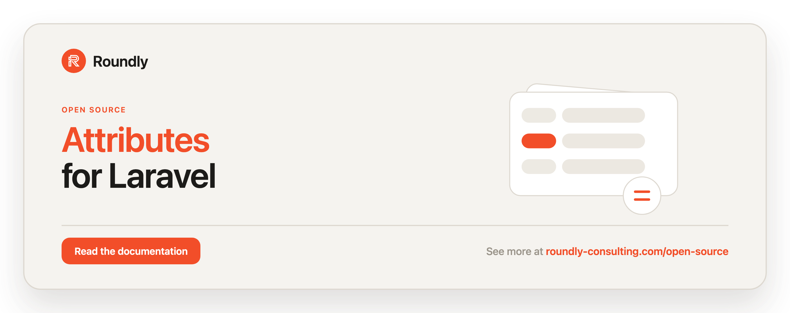

<!-- roundly-hero:start -->
<p align="center">
  <a href="https://roundly-consulting.com/open-source/docs/attributes-for-laravel?utm_source=github&utm_medium=readme&utm_campaign=open-source&utm_content=attributes-for-laravel">
    
  </a>
</p>
<!-- roundly-hero:end -->

# Attributes for Laravel

Attach multiple dynamic, **typed** key/value attributes to any Eloquent model. Add a single
trait to a model and store arbitrary, queryable attributes (with optional metadata) against it
through a polymorphic relationship — no schema changes per attribute, no EAV boilerplate.

Values keep their real PHP type (string, integer, float, boolean, array, datetime), an optional
registry validates known attributes, a fluent builder sets several at once, query scopes let you
filter owners by their attributes, and events let your app react to changes.

Beyond the typed core it also supports **encrypted values**, **unique** and **required**
constraints, **default values**, an optional **audit/history trail**, **per-model schemas**, a
typed `attr()` accessor, bulk read helpers, and friendly validation errors.

## Requirements

- PHP 8.4+
- Laravel 12 or 13

## Installation

Install the package via Composer:

```bash
composer require roundly-consulting/attributes-for-laravel
```

Publish and run the migration:

```bash
php artisan vendor:publish --tag="attributes-migrations"
php artisan migrate
```

Optionally publish the config file:

```bash
php artisan vendor:publish --tag="attributes-config"
```

The migration is auto-discovered, so the package works without publishing it. Publish only when
you want to customise the schema.

## Configuration

The published config file (`config/attributes.php`) exposes the following keys:

```php
return [
    'model' => \RoundlyConsulting\Attributes\Models\Attribute::class,
    'table' => 'attributes',
    'strict' => env('ATTRIBUTES_STRICT', false),
    'prune_after_days' => env('ATTRIBUTES_PRUNE_AFTER_DAYS', 30),
    'history' => [
        'enabled' => env('ATTRIBUTES_HISTORY', false),
        'table' => 'attribute_revisions',
    ],
    'definitions' => [
        // 'rating'  => ['type' => 'integer', 'rules' => ['min:1', 'max:5'], 'required' => true],
        // 'sku'     => ['type' => 'string', 'unique' => 'global'],
        // 'token'   => ['type' => 'string', 'encrypted' => true],
        // 'retries' => ['type' => 'integer', 'default' => 3],
    ],
];
```

| Key | Type | Default | Env | Purpose |
|-----|------|---------|-----|---------|
| `model` | `class-string` | `RoundlyConsulting\Attributes\Models\Attribute` | — | Model used to persist attributes. Point it at a subclass to override casts/scopes. |
| `table` | `string` | `attributes` | — | Table name used by the migration and model. |
| `strict` | `bool` | `false` | `ATTRIBUTES_STRICT` | When `true`, attaching an unregistered attribute throws `UnknownAttributeException`. |
| `prune_after_days` | `int` | `30` | `ATTRIBUTES_PRUNE_AFTER_DAYS` | Default age (days) for `attributes:prune`. |
| `history.enabled` | `bool` | `false` | `ATTRIBUTES_HISTORY` | When `true`, records an old→new revision on every attach/sync/detach. |
| `history.table` | `string` | `attribute_revisions` | — | Table name for the audit trail. |
| `definitions` | `array` | `[]` | — | Registry seed. Each entry supports `type`, `rules`, `required`, `default`, `unique`, `encrypted`. |

Each definition entry accepts:

| Definition key | Type | Purpose |
|----------------|------|---------|
| `type` | `string` | One of `AttributeType`: `string`, `integer`, `float`, `boolean`, `array`, `datetime`. |
| `rules` | `array` | Extra Laravel validation rules applied on attach. |
| `required` | `bool` | Enforced by `$model->validateAttributes()`. |
| `default` | `mixed` | Returned by typed reads when the attribute is unset. |
| `unique` | `string`/`bool` | `'owner'` (per owner type), `'global'` (across every owner), `true` (= owner) or `false`/`'none'`. |
| `encrypted` | `bool` | Stores the value as ciphertext via `Crypt` at rest. |

## Usage

Add the `HasAttributes` trait and implement the matching contract on any model you want to attach
attributes to:

```php
use Illuminate\Database\Eloquent\Model;
use RoundlyConsulting\Attributes\Contracts\HasAttributes as HasAttributesContract;
use RoundlyConsulting\Attributes\Traits\HasAttributes;

class Product extends Model implements HasAttributesContract
{
    use HasAttributes;
}
```

### Typed values

Values keep their real PHP type across write and read — no manual casting:

```php
$product->attachAttribute('color', 'white');     // string
$product->attachAttribute('rating', 5);          // int
$product->attachAttribute('on_sale', true);      // bool
$product->attachAttribute('price', 9.99);        // float
$product->attachAttribute('tags', ['a', 'b']);   // array
$product->attachAttribute('published_at', now()); // datetime

$product->getAttachedAttributeValue('rating');   // int(5)
$product->getAttachedAttributeValue('on_sale');  // true
```

The supported types are the cases of `RoundlyConsulting\Attributes\Enums\AttributeType`:
`string`, `integer`, `float`, `boolean`, `array`, `datetime`.

### The fluent builder

Set several typed attributes, attach metadata, and persist them in one readable statement:

```php
$product->attributes()
    ->set('color', 'white')->meta('color', ['hex' => '#fff'])
    ->set('rating', 5)
    ->set('on_sale', true)
    ->save();
```

`->sync()` replaces all attributes with the staged set (removing any not staged). `->forget()`,
`->only()` and `->except()` adjust what is staged before saving.

### Reading attributes

```php
$product->getAttachedAttributes();                      // ['color' => 'white', 'rating' => 5]
$product->getAttachedAttributeValue('color');           // typed value (mixed)
$product->getAttachedAttributeValueAsString('rating');  // '5' (string view)
$product->getAttachedAttribute('color');                // Attribute model or null
$product->hasAttachedAttribute('color');                // bool
$product->getAttachedAttributeMeta('color');            // Collection|null

// Typed convenience readers:
$product->attributeInt('rating');      // ?int
$product->attributeFloat('price');     // ?float
$product->attributeBool('on_sale');    // ?bool
$product->attributeArray('tags');      // ?array
$product->attributeDate('published_at'); // ?Carbon
```

All read methods are eager-loading aware: `$product->load('attachedAttributes')` first and the
reads run against the loaded relation.

### The `attr()` accessor

`attr()` returns a typed value object — one entry point instead of the six `attributeX()`
methods (which still work). Defaults defined in a definition are applied automatically.

```php
$product->attr('rating')->int();        // ?int (falls back to the defined default)
$product->attr('price')->float();       // ?float
$product->attr('on_sale')->bool();      // ?bool
$product->attr('tags')->array();        // ?array
$product->attr('published_at')->date(); // ?Carbon
$product->attr('color')->string();      // ?string
$product->attr('color')->raw();         // underlying typed value
$product->attr('color')->isNull();      // bool
(string) $product->attr('color');       // '' when unset, else the value
```

### Bulk reads & exports

```php
use RoundlyConsulting\Attributes\Facades\Attributes;
use RoundlyConsulting\Attributes\Models\Attribute;

Attributes::for($product)->all();        // Collection<name, value>
Attributes::for($product)->toKeyValue(); // array<name, value>
Attributes::for($product)->keys();       // list<string>
Attributes::for($product)->get('color'); // single value
Attributes::for($product)->has('color'); // bool

$product->attachedAttributes()->get()->toKeyValue(); // array<name, value>
Attribute::collect()->keyByName();                   // collection keyed by name
```

### Query scopes

Filter and order owner models by their attributes:

```php
Product::query()->whereAttribute('color', 'white')->get();
Product::query()->whereAttribute('rating', 5)->get();       // typed equality
Product::query()->whereAttributeIn('rating', [3, 5])->get();
Product::query()->whereHasAttribute('on_sale')->get();
Product::query()->whereDoesntHaveAttribute('on_sale')->get();
Product::query()->whereAttributeBetween('published_at', $from, $to)->get();
Product::query()->whereAttributeNull('note')->get();      // present, value NULL
Product::query()->whereAttributeNotNull('note')->get();
Product::query()->orderByAttribute('rating', 'desc')->get();
```

The `Attribute` model also exposes `forName`, `forOwner`, and `ofType` scopes.

> **Note:** values are stored in a text column, so `whereAttributeBetween` compares them
> lexicographically — reliable for ISO-8601 datetimes and strings, but integer ranges are
> zero-pad-sensitive. Encrypted values (below) cannot be matched by the `whereAttribute*` value
> scopes because their ciphertext is non-deterministic.

### Updating metadata and removing attributes

Removals soft-delete by default; pass `true` to force-delete permanently.

```php
$product->syncAttributeMeta('color', collect(['is_pretty' => 'yes']));

$product->detachAttribute('color');
$product->detachAttribute('color', forceDelete: true);
$product->detachAttributes(['color', 'size']);
$product->destroyAttributesExcept(['color']);
$product->destroyAttributes(['price']);
```

### Syncing

`syncAttributes` makes the model's attributes match the given set exactly:

```php
$product->syncAttributes([
    'color' => 'black',
    'size'  => 'large',
]);
```

### Definitions & validation

Register known attributes with a type and validation rules. When `strict` is enabled, attaching
an unregistered attribute throws; registered attributes are always validated.

```php
use RoundlyConsulting\Attributes\Facades\Attributes;
use RoundlyConsulting\Attributes\DataTransferObjects\AttributeDefinitionData;
use RoundlyConsulting\Attributes\Enums\AttributeType;

Attributes::define(new AttributeDefinitionData(
    name: 'rating',
    type: AttributeType::Integer,
    rules: ['min:1', 'max:5'],
));

$product->attachAttribute('rating', 9); // throws InvalidAttributeValueException
```

You can also seed definitions through the `definitions` config key.

### Per-model schemas

A model can declare its own definitions, merged over the global config for that model only.
Declare either a public `attributeDefinitions()` method or a `$attributeDefinitions` property:

```php
class Product extends Model implements HasAttributesContract
{
    use HasAttributes;

    /** @var array<string, array<string, mixed>> */
    protected array $attributeDefinitions = [
        'rating'  => ['type' => 'integer', 'rules' => ['min:1', 'max:5'], 'required' => true],
        'sku'     => ['type' => 'string', 'unique' => 'global'],
        'token'   => ['type' => 'string', 'encrypted' => true],
        'retries' => ['type' => 'integer', 'default' => 3],
    ];
}
```

### Constraints — unique & required

```php
Attributes::define(new AttributeDefinitionData('sku', AttributeType::String_, unique: UniqueScope::Global_));

$a->attachAttribute('sku', 'ABC');
$b->attachAttribute('sku', 'ABC'); // throws DuplicateAttributeValueException

$product->validateAttributes(); // throws MissingRequiredAttributeException if a required key is absent
```

`unique` accepts `UniqueScope::Owner` (unique per owner type), `UniqueScope::Global_` (unique
across every owner), or `UniqueScope::None`. Re-saving the same owner's own value is idempotent.

### Default values

A definition's `default` is returned by typed reads when the attribute is unset (defaults apply
on **read only** — they are never persisted, and bulk `getAttachedAttributes()` lists stored rows
only):

```php
Attributes::define(new AttributeDefinitionData('retries', AttributeType::Integer, default: 3));

$product->attributeInt('retries'); // 3 when unset, the stored value when set
$product->attr('retries')->int();  // 3
```

### Encrypted values

Mark a definition `encrypted: true` and its value is transparently `Crypt`-encrypted at rest and
decrypted on read. Works for every type; `null` values are never run through `Crypt`.

```php
Attributes::define(new AttributeDefinitionData('token', AttributeType::String_, encrypted: true));

$product->attachAttribute('token', 'secret');
$product->getAttachedAttributeValue('token'); // 'secret' (DB column holds ciphertext)
```

Because the ciphertext is non-deterministic, encrypted values cannot be matched by the
`whereAttribute*` value scopes.

### History / audit trail

Enable `attributes.history.enabled` (or `ATTRIBUTES_HISTORY=true`) to record an old→new revision
on every attach/sync/detach. Disabled by default, so there is no table cost unless you opt in.

```php
$product->history();          // Collection<AttributeRevision> — newest first
$product->history('color');   // filtered by attribute name
$product->attributeHistory(); // the underlying MorphMany relation
```

Each revision stores the change `type` (`attached`/`updated`/`detached`), the old and new value,
their types, and meta. Encrypted attributes are stored in their ciphertext form, so the audit log
never leaks secrets. Pruning the revisions table is left to the host application.

### Friendly validation errors

`InvalidAttributeValueException` carries the failing attribute name and the full validator bag:

```php
catch (InvalidAttributeValueException $e) {
    $e->attributeName; // 'rating'
    $e->messages();    // ['rating: The rating must be between 1 and 5.']
    $e->errorBag();    // Illuminate\Support\MessageBag|null
}
```

### Events

Listen for these events to extend behaviour (audit logs, search re-indexing, syncing):

- `RoundlyConsulting\Attributes\Events\AttributeAttached` — `(Model $owner, Attribute $attribute)`
- `RoundlyConsulting\Attributes\Events\AttributeDetached` — `(Model $owner, string $name)`
- `RoundlyConsulting\Attributes\Events\AttributesSynced` — `(Model $owner, array $attributes)`

### Console commands

```bash
# List the attributes attached to an owner record:
php artisan attributes:list "App\Models\Product" 42

# Permanently delete soft-deleted attributes older than N days (default from config):
php artisan attributes:prune --days=30 --force
```

## Integrates with

This package builds on other roundly-consulting packages:

- **[enums-for-laravel](https://github.com/roundly-consulting/enums-for-laravel)** — a hard
  dependency. Every enum this package ships (`AttributeType`, `UniqueScope`, `RevisionType`)
  uses the `RoundlyConsulting\Enums\Helpers` trait, so each gains the full ergonomic surface on
  top of its existing domain methods: `values()`, `names()`, `labels()`, `options()`,
  `toOptions()`, `toArray()`, `collect()`, `count()`, `random()`, `readable()`/`label()`, the
  case lookups (`fromName()`, `tryFromName()`, `fromLabel()`, `tryFromLabel()`, `hasName()`,
  `hasValue()`), and the fluent comparators (`is()`, `isNot()`, `isIn()`, `isNotIn()`,
  `whenIs*()`).
- **[package-toolkit-for-laravel](https://github.com/roundly-consulting/package-toolkit-for-laravel)**
  — a hard dependency. It provides the service-provider builder (config, migrations, commands and
  publish tags) and the validated `attributes.model` resolver, which checks that a swapped-in model
  really is an attribute model before the package queries through it. The package also reports its
  configuration to Laravel's `about` command (`php artisan about --only=attributes`); attribute
  definitions are reported by count only — an attribute name is a host's field name and often names
  the very secret the `encrypted` flag protects.

```php
use RoundlyConsulting\Attributes\Enums\AttributeType;

// Value => label map for a select input.
AttributeType::toOptions(); // ['string' => 'String', 'integer' => 'Integer', ...]

// Case lookups.
AttributeType::fromName('Integer');   // AttributeType::Integer
AttributeType::hasValue('datetime');  // true
```

### `AttributeType::validationRule()` caveat

`AttributeType` keeps its own **instance** `validationRule()`, which returns the Laravel rule
for a value of that type (`'string'`, `'integer'`, `'numeric'`, `'boolean'`, `'array'`,
`'date'`). This intentionally shadows the trait's **static** `validationRule()` membership rule,
so `AttributeType` does not expose the `in:...` form under that name. If a host needs the
membership rule, build it from the values:

```php
'in:'.AttributeType::values()->implode(','); // in:string,integer,float,boolean,array,datetime
```

`UniqueScope` and `RevisionType` have no such method, so they expose the trait's static
`validationRule()` normally (`UniqueScope::validationRule()` → `in:none,owner,global`).

## Testing

```bash
composer test
```

## Changelog

See [CHANGELOG](CHANGELOG.md) for recent changes.

## License

The MIT License (MIT). See [LICENSE](LICENSE.md) for details.
